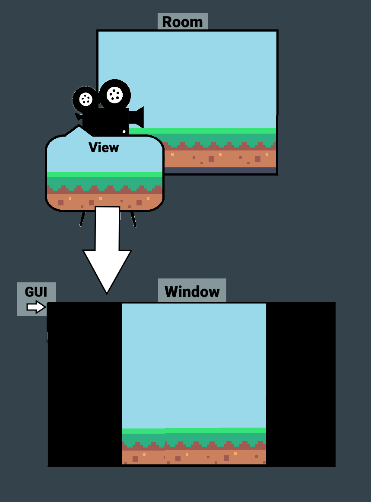
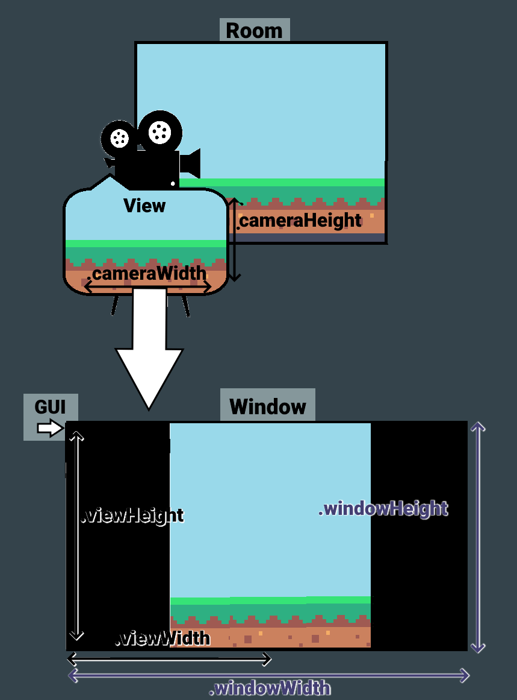

# PfCalculate

&nbsp;

	PfCalculate(configurationMacro, [resizewindow = false])

Calculates and returns a PictureFrame "result struct" based on an input configuration struct (please see [PfConfigGeneral()](PfConfigGeneral]) for more information). The result struct returned by PfCalculate() contains many variables that define the size and position of various parts of the render pipeline.

This function is provided for people who don't want to use [PfApply()](PfApply) and instead want to set up their render pipeline manually.

The "resizeWindow" argument controls whether results should be calculated as though the window will be resized to avoid black bars. This value is only relevant when the game is not
fullscreened and is therefore only relevant on desktop platforms (Windows, MacOS, Linux).

?> Because PfCalculate() does a lot of maths and returns a fresh struct every time it is called, you should avoid calling this function more often than is necessary.

|Name           |Datatype                  |Purpose                                                     |
|---------------|--------------------------|------------------------------------------------------------|
|`.cameraWidth, .cameraHeight`      |number                    | The roomspace width and height of the camera.            |
|`.cameraOverscan`|number|The number of extra pixels, in roomspace, to add around the edges of the camera. This is the same literal value as in the configuration struct and is included for convenience.|
|`.viewWidth, .viewHeight`       |number|WThe width and height of the view used to draw the camera to the application surface.  |
|`.viewScale`     |number| The scaling factor between the camera and the view. |
|`.viewOverscan`|number                   |The number of extra pixels, in roomspace, to add around the edges of the view. This is equal to .cameraOverscan multiplied by .viewScale and is provided for convenience.        |
|`.fullscreen` |boolean                   |Whether the game should be in fullscreen mode. This value is only relevant on desktop platforms (Windows, MacOS, Linux). On other platforms, this will always be **true**.|
|`.windowWidth,windowHeight` |number|The dimensions of the window. If the .fullscreen variable (see above) is **true** then these values will be the same as the display's width and height.|
|`.surfacePixelPerfect` |boolean|Whether the application surface should be drawn as pixel perfect where possible. This will cause [PfPostDrawAppSurface()](PfPostDrawAppSurface) to default to no texture filtering to preserve clean pixel edges.|
|`.surfacePostDrawScale`|number|The scaling factor between the view and the window (backbuffer). This includes the contribution from the overscan scale from the configuration struct.|
|`.surfacePostDrawX, .surfacePostDrawY` |number|The draw position for the application surface in the Post Draw event (i.e. the coordinates in the window/backbuffer). These values are in "window space' and will not necessarily line up with roomspace coordinates.|
|`.surfacePostDrawWidth, .surfacePostDrawHeight`|number|The size for the application surface in the Post Draw event (see above.) These values are in "window space' and will not necessarily line up with roomspace coordinates.|
|`.surfaceGuiX,.surfaceGuiY`|number|The draw position for the application surface on the GUI layer. These values are in "GUI-space' and will not necessarily line up with roomspace coordinates.|
|`.surfaceGuiWidth,.surfaceGuiHeight`|number|The size for the publication surface on the GUI layer. These values are in "GUI-space' and will not necessarily line up with roomspace coordinates.|
|`.marginsVisible`|boolean|Whether any of the margins are visible. You should check this variable before drawing the margins (using the variables below).|
|`.marginGuiX1,.marginGuiX2, .marginGuiX3,.marginGuiX4`|number|Coordinates for the margins around the application surface in GUI-space.|
|`.marginGuiY1,.marginGuiY2,.marginGuiY3,.marginGuiY4`|number|Coordinates for the margins around the application surface in GUI-space.|

## Diagrams

To help visualise what the different struct variables represent, it can be helpful to imagine the drawing pipeline like a movie set.

Now, if were to use PfGetApplied on this scenario, here's what the struct's width and height values would be measuring:

Note that the **window** here is the full size of the monitor, as it would be on a console or a monitor in fullscreen mode. The part in the middle is the application surface (pretend it's perfectly centered!), and the black bars are parts of the window where the application surface isn't being drawn. Also note that the GUI can be drawn on those empty parts , but by default PictureFrame sets the `(0,0)` position for the GUI to the top left corner of the application surface, so you'll need to use negative values.
