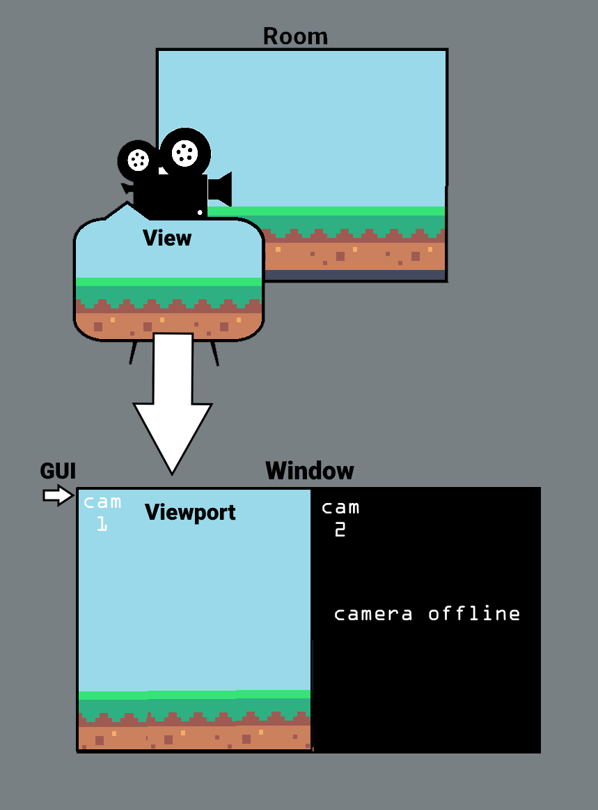

# Understanding Views, Windows and GUI

It can be difficult to conceptualise the relationship between the window, view and GUI size values. This section will attempt to simplify this.

# Definitions

In GameMaker:
-	a **room** is a space where instances of objects, tiles etc. are placed.
-	a **camera** is placed within the room and defines how the room will be displayed--position, orientation, aspect ratio etc.
-   the **view** refers to what a given camera is able to see, based on its position, rotation and projection.
-	the **viewport** is the part of the screen where the camera's view will be displayed.
-	the **GUI** is a special layer that is not affected by viewport/camera settings.
-	the **window** defines the amount of space the game takes up on a monitor. This is only relevant on desktop platforms; consoles always run in fullscreen mode.

# An Analogy

Let's imagine we're making a film.

If you imagine a cameraperson standing in a **room** with a physical **camera**, then the **view** is what you can see in the camera's viewfinder. It changes depending on how you hold the camera, how much zoom you apply, etc.

To enable the director to see what's on the camera, you would send the footage from the **view** to a **viewport**. The director might have multiple viewports to allow them to see the angles from different cameras; in that case, all those viewports could be drawn together in a **window** on their monitor.

Our director also wants to remember which viewport corresponds to which camera, so they put a sticker with the camera number over each viewport. That's the **GUI**.

