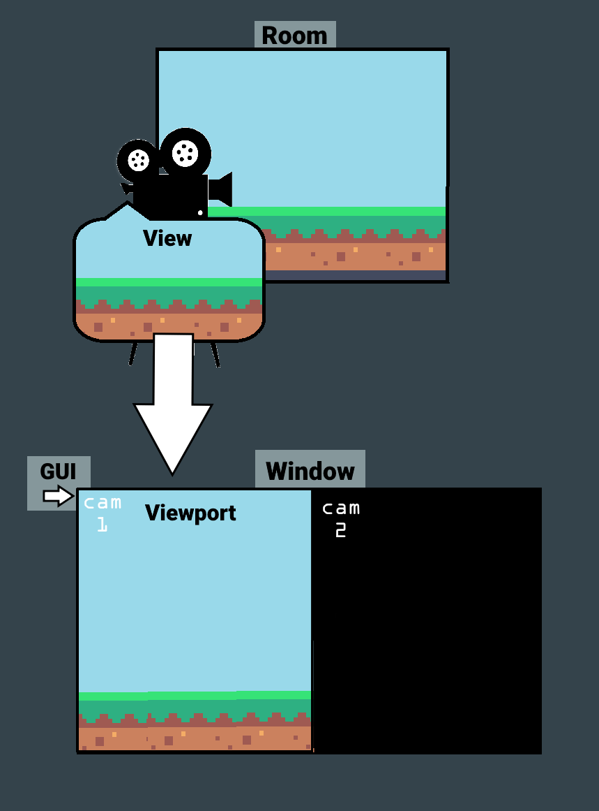
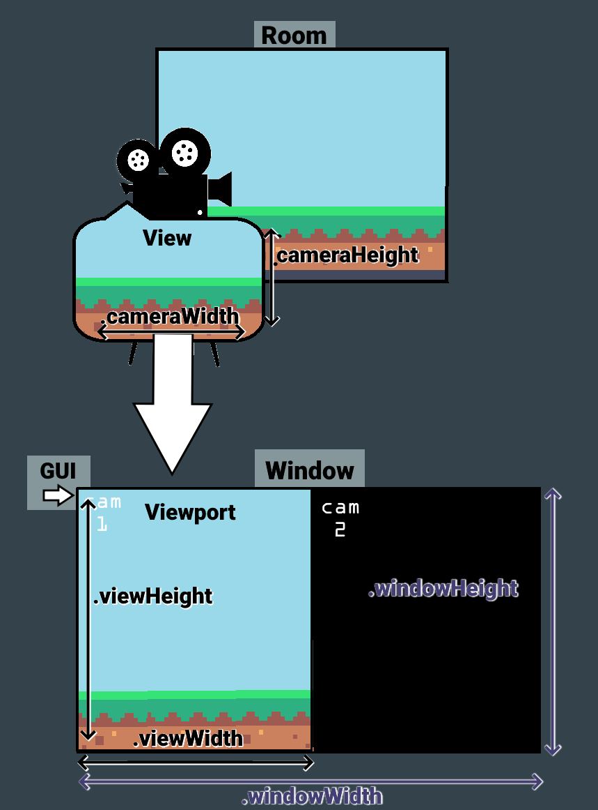

# Understanding Views, Windows and GUI

&nbsp;

It can be difficult to conceptualise the relationship between the window, view and GUI size values. This section will attempt to simplify this.

## Definitions

In GameMaker:
-	a **room** is a space where instances of objects, tiles etc. are placed.
-	a **camera** is placed within the room and defines how the room will be displayed--position, orientation, aspect ratio etc.
-   the **view** refers to what a given camera is able to see, based on its position, rotation and projection.
-	the **viewport** is the part of the screen where the camera's view will be displayed.
-	the **GUI** is a special layer that is not affected by viewport/camera settings.
-	the **window** defines the amount of space the game takes up on a monitor. This is only relevant on desktop platforms; consoles always run in fullscreen mode.
-	a **surface** is like a canvas, onto which GameMaker draws what it's instructed to. The **application surface** is where default Draw events draw to, but custom surfaces can be created as well.

## Camera, Viewport and Window

Let's imagine we're making a film.

If you imagine a cameraperson standing in a **room** with a physical **camera**, then the **view** is what you can see in the camera's viewfinder. It changes depending on how you hold the camera, how much zoom you apply, etc.

To enable the director to see what's on the camera, you would send the footage from the **view** to a **viewport**. The director might have multiple viewports to allow them to see the angles from different cameras; in that case, all those viewports could be drawn together in a **window** on their monitor.

Our director also wants to remember which viewport corresponds to which camera, so they put a sticker with the camera number over each viewport. That's the **GUI**.

Now, if were to use PfGetApplied on this scenario, here's what the struct's width and height values would be measuring:

Note that the **window** here is the full size of the monitor, as it would be on a console or a monitor in fullscreen mode. Also, PictureFrame doesn't actually support more than one view—I included a second one here for illustrative purposes only.

## The Drawing Pipeline

You're probably familiar with the **draw** event in GameMaker by now. It's what you use to tell GameMaker what to draw on the screen, but you can also use it to manipulate how the **view** is drawn.

**Draw** events are applied to something called a **surface**, which you can think of like a blank canvas. By default draw events are applied to the **application surface**, which is the main canvas on which your game is drawn before it's displayed on the screen. Normally, GameMaker handles this for you. When using PictureFrame, however, the application surface is drawn using Pf's custom code, so we need to manually tell GameMaker where and how to draw it. You can think of it like making an object, assigning it a sprite, and then using a custom draw event—it will be invisible unless you call draw_self()!

To do this, we use the Post Draw event. This event, as the name suggests, is triggered after all the main Draw events (but before the Draw GUI events).

The Draw process (when using PictureFrame) looks something like this:

1. PreDraw: GameMaker sets up the **display buffer**, the total amount of screen area it'll be drawing to, and calculates which viewports are visible and thus need to be drawn.
2. For each viewport (just one, in our case), each object, asset, layer etc. runs its DrawStart event, then Draw, then DrawEnd, onto the application surface. Once this is finished, 
3. PostDraw: This is where we run PfPostDrawAppSurface(), to enable GameMaker to draw the game onto the buffer. 