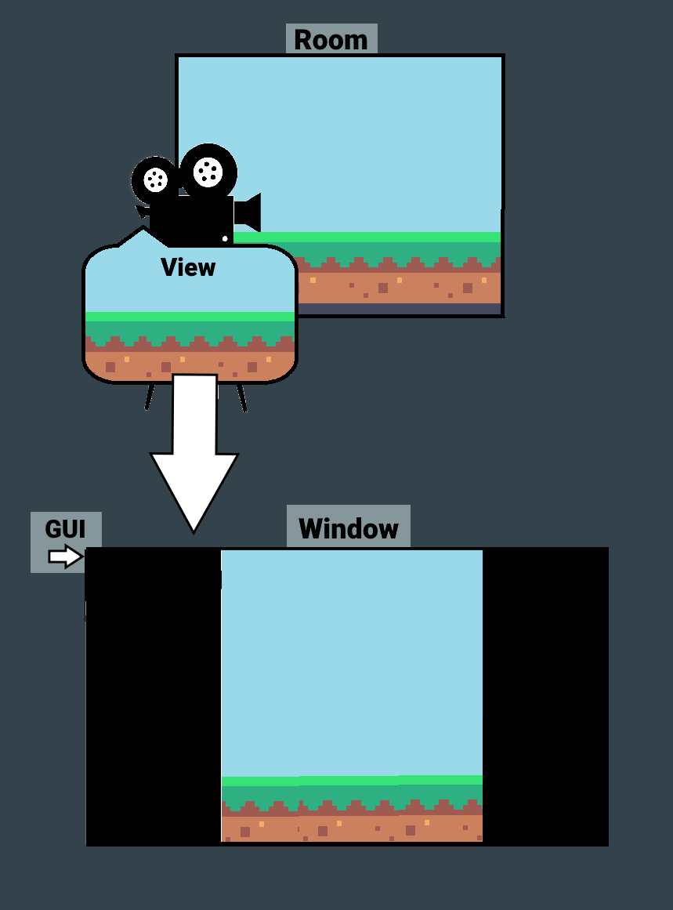
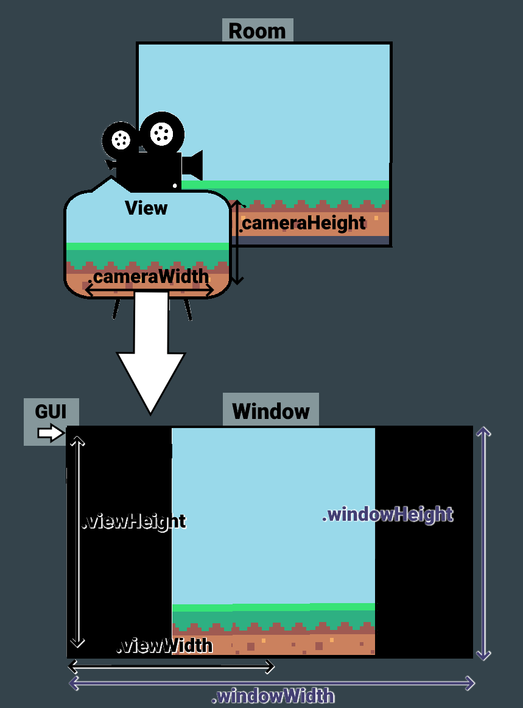

# PfCalculate

&nbsp;

`PfCalculate(configStruct, [tryResizeWindow=false])`

**Returns** Struct, a layout struct

|Name               |Datatype|Purpose                                                                                                           |
|-------------------|--------|------------------------------------------------------------------------------------------------------------------|
|`configStruct`     |struct  |PictureFrame configuration struct to calculate pipeline values for                                                |
|`[tryResizeWindow]`|boolean |Whether to allow resizing of the game window to fit the configuration struct. If not specified defaults to `false`|

Calculates and returns a PictureFrame "layout struct" based on an input configuration struct (please see `PfConfigGeneral()` for more information). The layout struct returned by `PfCalculate()` contains many variables that define the size and position of various parts of the render pipeline.

This function is provided for people who don't want to use `PfApply()` and instead want to set up their render pipeline manually.

!> Because `PfCalculate()` does a lot of maths and returns a fresh struct every time it is called, you should avoid calling this function more often than is necessary.

The `tryResizeWindow` parameter applies when the game is already windowed or is transitioning from fullscreen to a windowed state (as such, it only applies on desktop platforms). When `tryResizeWindow` is set to `true`, the function will calculate the layout struct with the presumption that the size of the window can change. If the `.trimBlackBars` option has been set to `true` then unnecessary extra space will be removed.

You may use the remaining optional arguments to override the current window state. This has limited uses in production but may be useful when testing.

&nbsp;

## Layout Struct

Variables that the layout struct holds are as follows:

|Name                                               |Datatype|Purpose                                                     |
|---------------------------------------------------|--------|------------------------------------------------------------|
|`.cameraWidth` `.cameraHeight`                  |number  |Roomspace width and height of the camera. This includes overscan pixels, if defined|
|`.cameraOverscan`                                  |number  |Number of extra pixels, in roomspace, to add around the edges of the camera. This is the same literal value as in the configuration struct and is included for convenience|
|`.viewWidth` `.viewHeight`                      |number  |Width and height of the view used to draw the camera to the application surface. This includes overscan pixels, if defined. When using `PfApply()`, the application surface size will match the view width and height|
|`.viewScale`                                       |number  |Scaling factor between the camera and the view. A scaling factor of 2 means that there will be 2 pixels on the view for every 1 pixel in roomspace on the camera. A view scale of exactly 1 is therefore a pixel perfect view|
|`.viewOverscan`                                    |number  |Number of extra pixels, in viewspace, that have been added around the edges of the view. This is equal to `.cameraOverscan` multiplied by `.viewScale` and is provided for convenience|
|`.fullscreen`                                      |boolean |Whether the game should be in fullscreen mode. This value is only relevant on desktop platforms (Windows, MacOS, Linux). On other platforms, this will always be `true`|
|`.windowWidth` `windowHeight`                   |number  |Dimensions of the window. If the `.fullscreen` variable (see above) is `true` then these values will be the same as the display's width and height|
|`.guiX` `guiY`                                  |number  |Coordinates of the top-left corner of the GUI layer in windowspace|
|`.guiWidth` `guiHeight`                         |number  |Width and height of the GUI layer|
|`.surfacePixelPerfect`                             |boolean |Whether the application surface should be drawn as pixel perfect where possible. This will cause `PfPostDrawAppSurface()` to default to no texture filtering to preserve clean pixel edges|
|`.surfacePostDrawScale`                            |number  |Scaling factor between the view and the window (backbuffer). This includes the contribution from the overscan scale from the configuration struct|
|`.surfacePostDrawX` `.surfacePostDrawY`         |number  |Draw position for the application surface in the Post Draw event (i.e. the coordinates in the window/backbuffer). These values are in "window space' and will not necessarily line up with roomspace coordinates|
|`.surfacePostDrawWidth` `.surfacePostDrawHeight`|number  |Size for the application surface in the Post Draw event (see above.) These values are in "window space' and will not necessarily line up with roomspace coordinates|
|`.surfaceGuiX` `.surfaceGuiY`                   |number  |Draw position for the application surface on the GUI layer. These values are in "GUI-space' and will not necessarily line up with roomspace coordinates|
|`.surfaceGuiWidth` `.surfaceGuiHeight`          |number  |Size for the publication surface on the GUI layer. These values are in "GUI-space' and will not necessarily line up with roomspace coordinates|
|`.marginsVisible`                                  |boolean |Whether any of the margins are visible. You should check this variable before drawing the margins (using the variables below)|
|`.marginWestX1` … `.marginSouthY2`           |number  |Coordinates for the margins around the application surface, in GUI-space|

&nbsp;

## Diagrams

To help visualise what the different struct variables represent, it can be helpful to imagine the drawing pipeline like a movie set.

Now, if were to use PfGetApplied on this scenario, here's what the struct's width and height values would be measuring:

Note that the **window** here is the full size of the monitor, as it would be on a console or a monitor in fullscreen mode. The part in the middle is the application surface (pretend it's perfectly centered!), and the black bars are parts of the window where the application surface isn't being drawn. Also note that the GUI can be drawn on those empty parts , but by default PictureFrame sets the `(0,0)` position for the GUI to the top left corner of the application surface, so you'll need to use negative values.